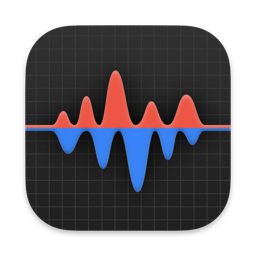

# Stats (LLM Fork by mondary)



[🇬🇧 EN](README_en.md) · [🇫🇷 FR](README.md)

✨ A Stats fork focused on LLM usage tracking in the macOS menu bar.

## ✅ Features
- Full Stats system monitoring (CPU, RAM, Disk, Network, Battery, Sensors, etc.).
- Added **LLM** module: **Codex, Claude, Gemini, GLM (z.ai)**.
- Codex quota view: `5h` and `Weekly`.
- Stack widget support for 2-line display (`5h` above `Weekly`).

## 🧠 Usage
- Open Stats and enable the **LLM** module in module settings.
- Select `Stack` widget to get vertical `5h/Weekly` rendering.
- LLM popup shows per-provider details (requests/tokens/cost when available).

## ⚙️ Settings
- Configurable provider log paths:
- Codex: `~/.codex/sessions`, `~/.codex/archived_sessions`
- Claude: `~/.claude/projects`, `~/.config/claude/projects`
- Gemini: `~/.gemini`, `~/.config/gemini`
- GLM: `~/.glm`, `~/.zai`, `~/.config/zai`

## 🧾 Commands
- Local build:
```bash
xcodebuild -project Stats.xcodeproj -scheme Stats -configuration Debug CODE_SIGNING_ALLOWED=NO build
```
- Launch debug build:
```bash
open -na ~/Library/Developer/Xcode/DerivedData/Stats-*/Build/Products/Debug/Stats.app
```

## 📦 Build & Package
- This fork keeps upstream Xcode project layout.
- Local unsigned test builds are supported via `CODE_SIGNING_ALLOWED=NO`.

## 🧪 Install (Antigravity)
- N/A for this project (native macOS app, not an Antigravity extension).

## 🧾 Changelog
- 0.1.0: Initial fork + LLM module (Codex, Claude, Gemini, GLM).
- 0.1.1: Improved LLM log parsing + Codex quota display (`5h/Weekly`).
- 0.1.2: Vertical LLM stack widget (`5h` above `Weekly`) + UI tweaks.

## 🔗 Links
- Upstream: https://github.com/exelban/stats
- Fork: https://github.com/mondary/stats
- FR README: [README.md](README.md)
